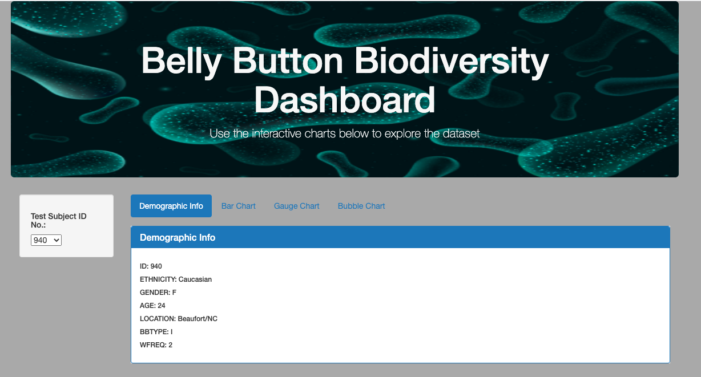

# Belly Button Biodiversity

## Overview
The goal was to automate a web browser with belly button biodiversity data. The belly button data dashboard was created to filter and display information specific to each volunteer including: demographic information, top 10 bacteria cultures found, bacteria cultures per sample and washing frequency.

To complete this work the following were used:

* Javascript
* Plotly and D3 libraries
* HTML/CSS portfolio to showcase the data
* Bootstrap components to polish and customize the portfolio
* GitHub Pages

